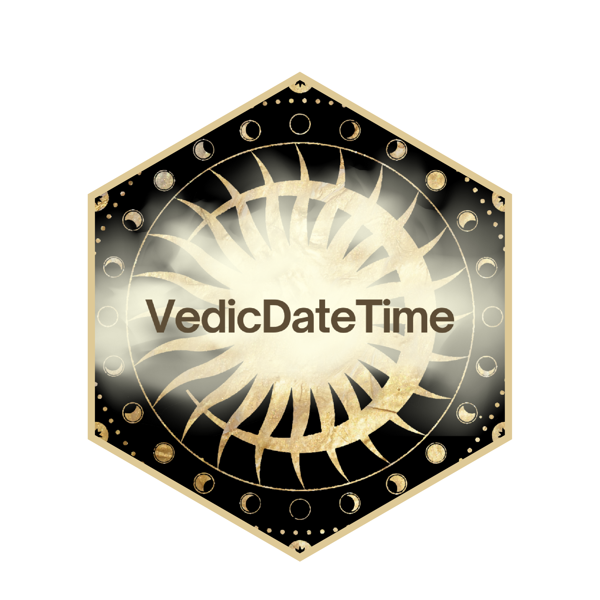

# VedicDateTime

An R Package to work with Vedic Calendar System.

## Build

- Clone the repository from Github
- `devtools::build()`
- `devtools::install()`

## Testing

To run the test cases
`devtools::test()`

## CRAN

Check [cran-comments.md](cran-comments.md) to verify latest updates

## Documentation

- `man/`
- [`doc/VedicDateTime.pdf`](doc/VedicDateTime.pdf)
